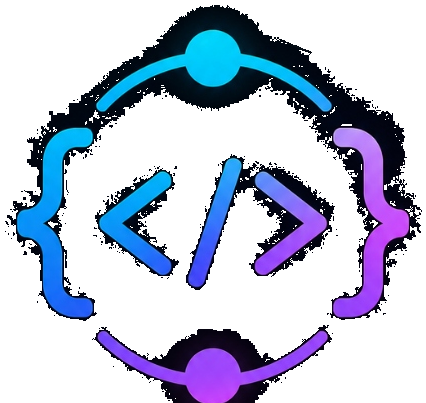

#  DevSync

[](https://devsync.vercel.app)
[](https://github.com/X-ImLucky-X/DevSync)
[](LICENSE)

> **DevSync** is a lightning-fast, zero-overhead collaborative workspace that unites real-time code editing, live whiteboard drawing, and stable multi-language compilation in one click.

---

## 🔗 Live Application
🌐 **Live Demo URL:** [https://devsync.vercel.app](https://devsync.vercel.app) *(Placeholder)*

---

## ✨ Features

### 💻 Code Workspace
- **Real-Time Pairing**: Collab-edit via Monaco Editor powered by Yjs Conflict-Free Replicated Data Types (CRDTs).
- **Online Presence**: Glowing participant tags showing exactly who is editing what lines.
- **Multi-Language Compiler**: Instantly execute **JavaScript**, **TypeScript**, **Python**, **C++**, **Go**, **Rust**, and **Java** code with standard inputs (`stdin`) and real-time execution console logging.
- **Accent Customizations**: Personalize your editor highlights on the fly.

### 🎨 Design Canvas
- **Figma-Grade Whiteboard**: Draw, drag, resize, and edit shapes collaboratively.
- **Supported Geometries**: Rectangles, Ellipses, Diamonds, Lines, Pen Drawings, and Text Nodes.
- **State Synchronization**: Node locking to prevent simultaneous modifications and keep coordinate layouts clean.

### 👥 Communication & Security
- **Secure Sessions**: Set room passwords and toggles for read-only spectating.
- **Activity Log**: Audited timeline of actions (joining, compilations, configuration adjustments).
- **Room Chat**: Embedded session messaging to chat with teammates.
- **Mobile Validation**: Responsive lockout blocker preventing layout breakages on phone screens with quick email sharing.

---

## 🔮 Roadmap & Future Features

We are actively working on expanding DevSync's capabilities. Here are the features planned for upcoming releases:

- [ ] **Multi-File Workspace (Files & Folders Support)**
  - Add a workspace file explorer sidebar to create, rename, delete, and switch between multiple files and folders in the same room.
- [ ] **AI-Powered Programming Assistant**
  - Integrate an inline AI assistant for real-time code autocomplete suggestions, syntax error explanations, code refactoring, and code generation.
- [ ] **Integrated Peer-to-Peer Calls**
  - Add WebRTC audio and video conferencing in the room sidebar to talk while pairing.
- [ ] **Canvas Template Exports**
  - Export whiteboard drawings as clean SVGs or PNG files, or save custom elements as templates.

---

## 🛠️ Tech Stack

| Layer | Technologies |
| :--- | :--- |
| **Frontend** | React, TypeScript, TailwindCSS, Monaco Editor, Framer Motion, Yjs, Vite |
| **Backend** | Node.js, Express, WebSockets (`ws`), Yjs WebSocket Provider |
| **Execution** | Wandbox Compilers Engine API Integration |
| **Build System** | Turborepo Monorepo |

---

## 📦 Project Structure

```text
DevSync/
├── apps/
│   ├── web/          # Vite React Front-End UI Client
│   └── server/       # Node.js WebSocket Room State & Synchronization Server
├── packages/
│   └── protocol/     # Shared Type Definitions and Message Contracts
├── docker-compose.yml# Server Environment Setup Configuration
└── package.json      # Workspace Dependencies Configuration
```

---

## 🛡️ License
Distributed under the MIT License. See [LICENSE](LICENSE) for more details.

---

## 🚀 Getting Started

### 📋 Prerequisites
Make sure you have [Node.js](https://nodejs.org/) (v18+) and [npm](https://www.npmjs.com/) installed on your machine.

### 🔧 Installation & Setup

1. **Clone the Repository:**
   ```bash
   git clone https://github.com/X-ImLucky-X/DevSync.git
   cd DevSync
   ```

2. **Install Dependencies:**
   Install monorepo package roots:
   ```bash
   npm install
   ```

3. **Start Development Servers:**
   Launch turborepo workspace dev servers concurrently:
   ```bash
   npm run dev
   ```
   - **Frontend UI Client:** Runs at [http://localhost:5173](http://localhost:5173)
   - **WebSocket Sync Server:** Runs at [http://localhost:3002](http://localhost:3002)

---

## 🌟 Support
If you like this project, star the repository on [GitHub](https://github.com/X-ImLucky-X/DevSync) and follow the developer! Created by **[X-ImLucky-X](https://github.com/X-ImLucky-X)**.
